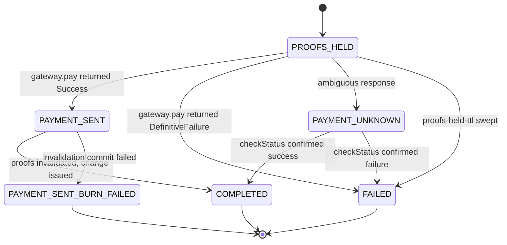

# Melt saga states

Every melt attempt walks a state machine defined in `MeltSagaState`. Transitions
are **append-only** and recorded in the `melt_saga_transition` ledger, so the
history of an attempt is reconstructable rather than inferred.

Two states require operator action and will never resolve themselves. Those are the
reason this page exists.

Spec 002 § Saga state machine.

## States

| State | Meaning | Terminal |
|-------|---------|----------|
| `PROOFS_HELD` | Proofs durably committed to `PENDING`; `gateway.pay` has not returned | |
| `PAYMENT_SENT` | `gateway.pay` returned a definitive `Success`; final invalidation pending | |
| `COMPLETED` | Happy path: proofs `SPENT`, change issued | ✓ |
| `FAILED` | `gateway.pay` returned `DefinitiveFailure`; proofs back to `UNSPENT` | ✓ |
| `PAYMENT_SENT_BURN_FAILED` | **Payment succeeded but proof invalidation failed** | ✓ |
| `PAYMENT_UNKNOWN` | Ambiguous provider response: timeout, 5xx, or missing `payment_hash` | |

Note that `isTerminal()` returns true for `COMPLETED`, `FAILED`, and
`PAYMENT_SENT_BURN_FAILED`. **`PAYMENT_UNKNOWN` is not terminal**, because the
reconciler is still trying to resolve it.

## The two states that need a human

### `PAYMENT_SENT_BURN_FAILED`

The external payment succeeded, but the commit that invalidates the proofs failed.
The proofs stay in `PENDING`.

**There is no automatic retry** (FR-007 / FR-011). This is deliberate: money has
already left, and the safe resolution depends on facts the mint cannot establish
alone. Automatically releasing the proofs would let the same value be spent twice,
having already paid out.

Resolve by confirming the payment settled with the Lightning provider, then
invalidating the proofs through operator tooling.

### `PAYMENT_UNKNOWN`

The provider's response was ambiguous. The saga **must not auto-advance to
`COMPLETED` without independent confirmation** (FR-008), because treating a timeout
as success would burn a customer's proofs for a payment that may never have gone
out.

`MeltSagaReconciler` polls `checkStatus` for a bounded window and advances the
saga on a definitive answer. After `payment-unknown-ttl` it fires an operator alert
and **leaves the saga in `PAYMENT_UNKNOWN`**; it never resolves it by assumption.

## The reconciler

`MeltSagaReconciler` (in `cashu-mint-jpa`, gated on `cashu.mint.jpa.enabled=true`)
runs on a schedule and does two things:

1. Polls `LightningPaymentPort.checkStatus` for every `PAYMENT_UNKNOWN` saga,
   advancing to `COMPLETED` or `FAILED` on a definitive response. After
   `payment-unknown-ttl`, alerts and leaves the saga alone.
2. Sweeps stale `PROOFS_HELD` sagas older than `proofs-held-ttl` to `FAILED`, so
   held proofs are not stuck indefinitely (research R9).

**The reconciler must never call `LightningPaymentPort.pay`** (FR-007). It reads
provider state through `checkStatus` only. A reconciler that could pay would be
able to double-pay an attempt whose first payment simply had not been observed yet.

## Configuration

| Property | Env | Default | Purpose |
|----------|-----|---------|---------|
| `cashu.mint.melt.payment-timeout` | `MINT_MELT_PAYMENT_TIMEOUT` | `PT30S` | Max wait for `pay` before the outcome is treated as Unknown |
| `cashu.mint.melt.reconcile-interval` | `MINT_MELT_RECONCILE_INTERVAL` | `PT60S` | Reconciler cadence |
| `cashu.mint.melt.payment-unknown-ttl` | `MINT_MELT_PAYMENT_UNKNOWN_TTL` | `PT1H` | How long a saga may stay `PAYMENT_UNKNOWN` before alerting |
| `cashu.mint.melt.proofs-held-ttl` | `MINT_MELT_PROOFS_HELD_TTL` | `PT5M` | `PROOFS_HELD` older than this is moved to `FAILED` |

## Monitoring

`cashu_mint_melt_stuck_payment_unknown` is re-derived by `InvariantGaugePoller`
(`cashu.mint.invariant.poll-interval`, default `PT60S`) from the reviewed operator
SQL. Note the poller assumes a single mint instance.

Alert on:

| Signal | Why |
|--------|-----|
| Any transition to `PAYMENT_SENT_BURN_FAILED` | Money left without proofs being invalidated. Always needs a human |
| `PAYMENT_UNKNOWN` older than `payment-unknown-ttl` | The reconciler has given up; provider state is still unresolved |
| Growth in `PROOFS_HELD` | Payments are not returning; proofs are locked meanwhile |

## Related

- [Proof holds in cashu-vault](https://github.com/398ja/cashu-vault/blob/main/docs/how-to/work-with-proof-holds.md)
  — the vault side of the same hold. A stale **melt** hold is released; a stale
  **swap** hold that reached signing must be committed. Read that before resolving
  a held proof by hand.
- [Supported NUTs](../reference/nuts.md) — NUT-05 melt
- [Configuration reference](../reference/configuration.md)
